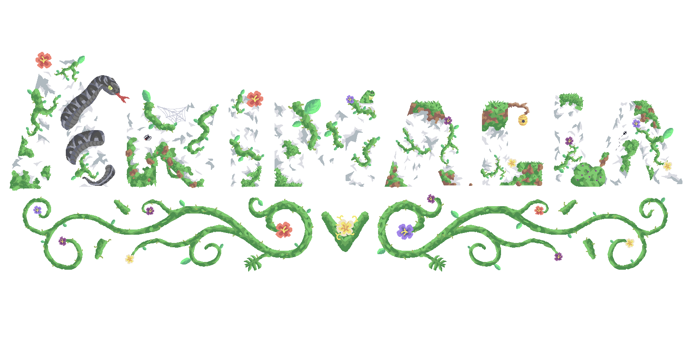

With the purpose of add some biology to Mindustry, Animalia is a mod that contains unique _biological forms, blocks, machines and mechanics_ to discover the world of the Animalia Kingdom!

The animals are made to be cute and useful, giving the game a new vibe.

Frogs are the only animals for now, but only for now. More animals are being created.

# Compatibility:
Compatibility is not totally stable **in mobile**, also V6 _does not support the entire mod_. If you are a mobile user, please let me know if you are having issues.  Describe the problem (if there is a crash, please send the crash log) and (if possible) attach images of it. You can create a new issue here: https://github.com/FlinTyX/Animalia/issues/new.
